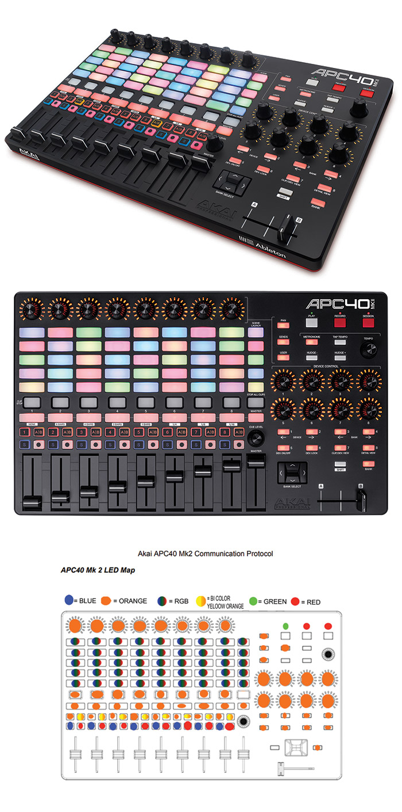

# akai-apc40-mk2

*Akai APC40 MK2: Outgoing MIDI API Messaging + Color Utils*

The Akai outgoing MIDI API for the [APC40 MK2](https://www.akaipro.com/apc40-mkii) controller - in a easy to use/port Utility class.

Wrote this for a project that required full outgoing RGB control (PC/Host -> Akai device) of the APC40. Perhaps someone else will find it useful.


### Features

- Control all light sources (everything), using the official outgoing MIDI protocol.
- Switch on the fly between the (3) firmware modes. 
- Control all (8) Bi Color buttons, with Off/Yellow/Orange support.
- Control all (16) LED knobs, including switching between Default, Pan, and Volume "styles".
- Control all (45) RBG LED pads, including switching between Solid, Oneshot, Pulse, Blink modes.
- Blinking/Pulse modes for 1/1, 1/2, 1/4, 1/8, 1/16, 1/24 support.
- Control LED diodes for Play, Record, Session.
- Control LEDs for Device/Bank & the 1-8 Buttons.
- RBG reference colors in formats: RGB, Hex, Bytecode.
- Pass in any color value and determine which supported color code is the best match.


### Official Protocol Documentation

Based on the: Akai APC40 Mk2 Communications Protocol Version 1.2
https://www.akaipro.com/amfile/file/download/file/495/product/15


### Firmware Modes (3)

**Notes Regarding Generic Mode (Mode 0):** 

- [CLIP LAUNCH] buttons are momentary and should light its LED when ON.
- [CLIP STOP] buttons are momentary and should light its LED when ON. -[ACTIVATOR], [SOLO], [RECORD ARM] are toggle buttons and should light its LED when ON.
- [TRACK SELECTION] buttons (1-8 + MASTER) are radio style and only one of the 9 buttons is ON at a time. When ON its LED should light. These buttons will NOT send out MIDI in generic mode for its state. These buttons dictate which one of nine banks the DEVICE CONTROL knobs and DEVICE CONTROL switches belong to. These knobs and switches will output on a different MIDI channel based on the current Track Selection (track 1 = MIDI channel 0, track 8 = MIDI channel 7, MASTER = MIDI channel 8). Upon pressing one of the Track Selection buttons, the current position of the 8 Device Control knobs will be sent. 
- [TRACK ACTIVATOR] buttons (1-8) are toggle buttons and will light its LED when ON.
- [CROSSFADER A/B], is a momentary button and will light its LED when ON
- [TRACK SOLO], and [RECORD ARM] buttons are toggle buttons and will light its LED when ON
- [DEVICE LEFT (1)], [DEVICE RIGHT (2)], [BANK LEFT (3)], [BANK RIGHT (4)] will be toggle style and will light its LED when ON.
- [DEVICE ON/OFF (5)], [DEVICE LOCK (6)], [CLIP/DEVICE VIEW (7)], [DETAIL VIEW (8)] will be momentary style and will light its LED when ON.
- [BANK LOCK] button is momentary and will light its LED when ON.
- [SCENE LAUNCH] and [STOP ALL CLIPS] buttons are momentary buttons and will light its LED when ON.
- TRACK CONTROL buttons are toggle buttons and will light its LED when ON.
- TRACK CONTROL KNOBS and buttons are NOT banked in any way.
- [UP], [DOWN], [LEFT], [RIGHT], [SHIFT], [NUDGE+], [NUDGE-], [METRONOME], and [TAP TEMPO] are momentary buttons
- [PLAY], [RECORD], and [SESSION RECORD] are momentary buttons and will light its LED when ON.
- [PAN], [SENDS], [USER], are toggle buttons and will light its LED when ON.
- LED rings are all set to SINGLE style.

**Notes Regarding Ableton Live Mode (Mode 1):**

- All buttons are momentary buttons.
- Device control knobs and buttons are not banked within the APC40 Mk2.
- LED Rings around the knobs are controlled by the APC40 but can be updated by the Host.
- All other LEDs are controlled by the Host.

**Notes Regarding Alternate Ableton Live Mode (Mode 2):**
- All buttons are momentary buttons.
- Device control knobs and buttons are not banked within the APC40 Mk2.
- All LEDs are controlled by the Host.

### Dependencies

None: This class is currently hardwired to point to [MidiBus](http://www.smallbutdigital.com/projects/themidibus/), however it could easily be exchanged for another Midi API.

All touch points for the outgoing API are routed through 3 methods, outlined below:

```
private static void midiSendMessage(MidiBus midiBus, byte[] data) {
	midiBus.sendMessage(data);
}

private static void midiSendNoteOn(MidiBus midiBus, int channel, int pitch, int velocity) {
	midiBus.sendNoteOn(channel, pitch, velocity);
}

private static void midiSendControllerChange(MidiBus midiBus, int channel, int pitch, int velocity) {
	midiBus.sendControllerChange(channel, pitch, velocity);
}
```

Update these methods (exchange MidiBus class), to send all the commands to another API.


### LED Map



### RGB Color Codes (128 total)

- 0x000000
- 0x1E1E1E
- 0x7F7F7F
- 0xFFFFFF
- 0xFF4C4C
- 0xFF0000
- 0x590000
- 0x190000
- 0xFFBD6C
- 0xFF5400
- 0x591D00
- 0x271B00
- 0xFFFF4C
- 0xFFFF00
- 0x595900
- 0x191900
- 0x88FF4C
- 0x54FF00
- 0x1D5900
- 0x142B00
- 0x4CFF4C
- 0x00FF00
- 0x005900
- 0x001900
- 0x4CFF5E
- 0x00FF19
- 0x00590D
- 0x001902
- 0x4CFF88
- 0x00FF55
- 0x00591D
- 0x001F12
- 0x4CFFB7
- 0x00FF99
- 0x005935
- 0x001912
- 0x4CC3FF
- 0x00A9FF
- 0x004152
- 0x001019
- 0x4C88FF
- 0x0055FF
- 0x001D59
- 0x000819
- 0x4C4CFF
- 0x0000FF
- 0x000059
- 0x000019
- 0x874CFF
- 0x5400FF
- 0x190064
- 0x0F0030
- 0xFF4CFF
- 0xFF00FF
- 0x590059
- 0x190019
- 0xFF4C87
- 0xFF0054
- 0x59001D
- 0x220013
- 0xFF1500
- 0x993500
- 0x795100
- 0x436400
- 0x033900
- 0x005735
- 0x00547F
- 0x0000FF
- 0x00454F
- 0x2500CC
- 0x7F7F7F
- 0x202020
- 0xFF0000
- 0xBDFF2D
- 0xAFED06
- 0x64FF09
- 0x108B00
- 0x00FF87
- 0x00A9FF
- 0x002AFF
- 0x3F00FF
- 0x7A00FF
- 0xB21A7D
- 0x402100
- 0xFF4A00
- 0x88E106
- 0x72FF15
- 0x00FF00
- 0x3BFF26
- 0x59FF71
- 0x38FFCC
- 0x5B8AFF
- 0x3151C6
- 0x877FE9
- 0xD31DFF
- 0xFF005D
- 0xFF7F00
- 0xB9B000
- 0x90FF00
- 0x835D07
- 0x392b00
- 0x144C10
- 0x0D5038
- 0x15152A
- 0x16205A
- 0x693C1C
- 0xA8000A
- 0xDE513D
- 0xD86A1C
- 0xFFE126
- 0x9EE12F
- 0x67B50F
- 0x1E1E30
- 0xDCFF6B
- 0x80FFBD
- 0x9A99FF
- 0x8E66FF
- 0x404040
- 0x757575
- 0xE0FFFF
- 0xA00000
- 0x350000
- 0x1AD000
- 0x074200
- 0xB9B000
- 0x3F3100
- 0xB35F00
- 0x4B1502